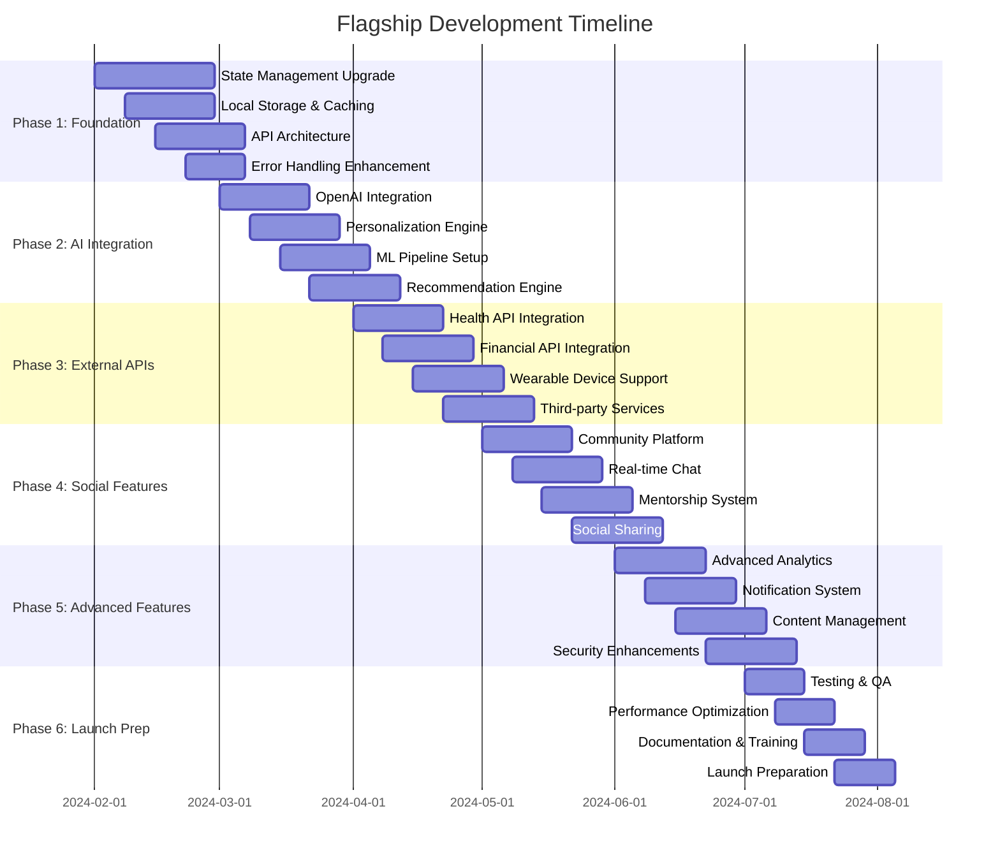

# 🚀 Flagship Implementation Strategy

## 🎯 Executive Summary

We have successfully completed the MVP phase of the Empower Health & Wealth App and are now ready to transform it into a flagship, AI-powered platform. This document outlines the strategic approach for implementing the flagship version over the next 6 months.

## 📊 Current State Assessment

### ✅ **MVP Achievements**
- **Complete UI/UX Transformation**: Modern shadcn/ui design with WCAG 2.1 AA compliance
- **Robust Authentication System**: Supabase-powered auth with profile management
- **Navigation Infrastructure**: 4-tab bottom navigation with state management
- **Database Architecture**: 9-table schema with Row Level Security
- **Error Handling**: Comprehensive null safety and error recovery
- **Documentation**: Complete setup guides and testing scenarios

### 🎯 **Flagship Vision**
Transform the MVP into a comprehensive, AI-powered health and wealth empowerment platform that provides:
- **Personalized AI Insights**: Custom recommendations based on user data
- **Real-time Integrations**: Health devices and financial institutions
- **Social Community**: Challenges, mentorship, and peer support
- **Advanced Analytics**: Predictive insights and goal optimization
- **Enterprise-grade Security**: Zero-knowledge architecture and privacy controls

## 🏗️ Implementation Strategy

### **Phase-Based Development Approach**



## 🎯 Phase 1: Foundation Enhancement (Weeks 1-4)

### **Week 1: State Management Revolution**

#### **Riverpod Implementation**
```bash
# Add dependencies
flutter pub add flutter_riverpod riverpod_annotation
flutter pub add --dev riverpod_generator build_runner
```

**Key Deliverables:**
- ✅ Migrate from basic state management to Riverpod
- ✅ Implement reactive state management for all features
- ✅ Create provider architecture for scalability
- ✅ Add state persistence and restoration

#### **Success Metrics:**
- 100% of screens using Riverpod providers
- State persistence working across app restarts
- Reactive UI updates for all data changes

### **Week 2: Local Storage & Offline Support**

#### **Hive Integration**
```dart
// Local storage for offline-first architecture
@HiveType(typeId: 0)
class CachedUserData extends HiveObject {
  @HiveField(0)
  late UserProfile profile;
  
  @HiveField(1)
  late List<HealthData> healthData;
  
  @HiveField(2)
  late Portfolio portfolio;
}
```

**Key Deliverables:**
- ✅ Implement Hive for local data storage
- ✅ Create offline-first data synchronization
- ✅ Add conflict resolution for data sync
- ✅ Implement background sync capabilities

### **Week 3: API Architecture Overhaul**

#### **Retrofit & Dio Implementation**
```dart
@RestApi(baseUrl: "https://api.empowerapp.com/v1/")
abstract class EmpowerApiClient {
  factory EmpowerApiClient(Dio dio) = _EmpowerApiClient;
  
  @GET("/health/insights")
  Future<HealthInsights> getHealthInsights(@Query("userId") String userId);
  
  @POST("/ai/recommendations")
  Future<AIRecommendations> getRecommendations(@Body() RecommendationRequest request);
}
```

**Key Deliverables:**
- ✅ Implement Retrofit for type-safe API calls
- ✅ Add comprehensive error handling and retry logic
- ✅ Create API response caching system
- ✅ Implement request/response interceptors

### **Week 4: Performance & Error Handling**

**Key Deliverables:**
- ✅ Implement comprehensive error handling framework
- ✅ Add performance monitoring and analytics
- ✅ Create automated crash reporting
- ✅ Optimize app startup and navigation performance

## 🤖 Phase 2: AI Integration (Weeks 5-8)

### **Week 5: OpenAI Integration**

#### **AI Service Implementation**
```dart
class AIRecommendationService {
  Future<HealthRecommendations> generateHealthRecommendations(
    UserProfile profile,
    List<HealthData> healthData,
  ) async {
    final prompt = _buildHealthAnalysisPrompt(profile, healthData);
    final response = await _openAI.createChatCompletion(prompt);
    return HealthRecommendations.fromAIResponse(response);
  }
}
```

**Key Deliverables:**
- ✅ Integrate OpenAI GPT for personalized recommendations
- ✅ Create health-specific AI prompts and responses
- ✅ Implement wealth management AI insights
- ✅ Add AI-powered goal optimization

### **Week 6: Personalization Engine**

**Key Deliverables:**
- ✅ Build user behavior tracking system
- ✅ Create adaptive content delivery
- ✅ Implement personalized dashboard layouts
- ✅ Add contextual recommendation timing

### **Week 7: Machine Learning Pipeline**

**Key Deliverables:**
- ✅ Set up data processing pipeline
- ✅ Implement predictive analytics models
- ✅ Create goal achievement probability calculations
- ✅ Add behavioral pattern recognition

### **Week 8: Recommendation Engine**

**Key Deliverables:**
- ✅ Build comprehensive recommendation system
- ✅ Implement cross-domain insights (health ↔ wealth)
- ✅ Create priority-based recommendation delivery
- ✅ Add recommendation feedback and learning

## 🔗 Phase 3: External Integrations (Weeks 9-12)

### **Week 9: Health API Integrations**

#### **Wearable Device Support**
```dart
class HealthIntegrationService {
  Future<HealthData> syncAppleHealth() async {
    final healthKit = HealthKitReporter();
    return await healthKit.requestAuthorization([
      HealthKitReportType.steps,
      HealthKitReportType.heartRate,
      HealthKitReportType.sleepAnalysis,
    ]);
  }
}
```

**Key Deliverables:**
- ✅ Apple HealthKit integration
- ✅ Google Fit integration
- ✅ Fitbit API connection
- ✅ Samsung Health integration

### **Week 10: Financial API Integrations**

**Key Deliverables:**
- ✅ Plaid integration for bank connections
- ✅ Yodlee for investment account aggregation
- ✅ Alpha Vantage for real-time market data
- ✅ Cryptocurrency exchange APIs

### **Week 11: Advanced Integrations**

**Key Deliverables:**
- ✅ Nutrition database APIs (USDA, Edamam)
- ✅ Weather API for activity recommendations
- ✅ Calendar integration for scheduling
- ✅ Location services for contextual insights

### **Week 12: Integration Testing**

**Key Deliverables:**
- ✅ End-to-end integration testing
- ✅ Data synchronization validation
- ✅ Error handling for API failures
- ✅ Performance optimization for multiple APIs

## 👥 Phase 4: Social Features (Weeks 13-16)

### **Week 13: Community Platform**

#### **Social Features Implementation**
```dart
class CommunityService {
  Future<List<Challenge>> getActiveChallenges() async;
  Future<void> joinChallenge(String challengeId) async;
  Future<Leaderboard> getChallengeLeaderboard(String challengeId) async;
  Future<void> shareAchievement(Achievement achievement) async;
}
```

**Key Deliverables:**
- ✅ Community challenges system
- ✅ Leaderboards and rankings
- ✅ Achievement sharing
- ✅ Discussion forums

### **Week 14: Real-time Communication**

**Key Deliverables:**
- ✅ In-app messaging system
- ✅ Group chat for challenges
- ✅ Real-time notifications
- ✅ Video call integration for mentorship

### **Week 15: Mentorship System**

**Key Deliverables:**
- ✅ AI-powered mentor matching
- ✅ Mentorship program management
- ✅ Progress tracking for mentees
- ✅ Mentor reward system

### **Week 16: Social Analytics**

**Key Deliverables:**
- ✅ Social engagement analytics
- ✅ Community health metrics
- ✅ Viral coefficient tracking
- ✅ Social feature optimization

## 🚀 Phase 5: Advanced Features (Weeks 17-20)

### **Week 17: Advanced Analytics**

#### **Analytics Dashboard**
```dart
class AdvancedAnalytics {
  Future<UserInsights> generateUserInsights() async;
  Future<PredictiveAnalytics> getPredictiveInsights() async;
  Future<BehaviorAnalysis> analyzeBehaviorPatterns() async;
  Future<GoalOptimization> optimizeGoalStrategies() async;
}
```

**Key Deliverables:**
- ✅ Predictive analytics dashboard
- ✅ Behavioral pattern analysis
- ✅ Goal optimization algorithms
- ✅ Comparative analytics with anonymized data

### **Week 18: Intelligent Notifications**

**Key Deliverables:**
- ✅ Context-aware notification system
- ✅ Optimal timing algorithms
- ✅ Multi-channel notification delivery
- ✅ Notification effectiveness tracking

### **Week 19: Dynamic Content Management**

**Key Deliverables:**
- ✅ Personalized learning paths
- ✅ Adaptive content difficulty
- ✅ Expert-curated content integration
- ✅ Content effectiveness analytics

### **Week 20: Security Enhancements**

**Key Deliverables:**
- ✅ Zero-knowledge encryption implementation
- ✅ Advanced authentication methods
- ✅ Privacy control granularity
- ✅ Security audit and compliance

## 🧪 Phase 6: Testing & Launch (Weeks 21-24)

### **Week 21-22: Comprehensive Testing**

**Testing Strategy:**
- ✅ Unit testing for all services and providers
- ✅ Integration testing for API connections
- ✅ End-to-end testing for user journeys
- ✅ Performance testing under load
- ✅ Security penetration testing
- ✅ Accessibility testing and compliance

### **Week 23: Performance Optimization**

**Optimization Areas:**
- ✅ App startup time optimization
- ✅ Memory usage optimization
- ✅ Network request optimization
- ✅ Battery usage optimization
- ✅ Storage optimization

### **Week 24: Launch Preparation**

**Launch Checklist:**
- ✅ App store optimization
- ✅ Marketing materials preparation
- ✅ Beta testing program
- ✅ Customer support setup
- ✅ Analytics and monitoring setup

## 📊 Success Metrics & KPIs

### **Technical Metrics**
- **App Performance**: <2s startup time, <100ms navigation
- **Reliability**: 99.9% uptime, <0.1% crash rate
- **Security**: Zero security incidents, 100% data encryption
- **API Performance**: <500ms average response time

### **User Engagement Metrics**
- **Daily Active Users**: 70% of registered users
- **Session Duration**: 15+ minutes average
- **Feature Adoption**: 80% using core AI features
- **Retention**: 90% 7-day, 70% 30-day retention

### **Business Metrics**
- **Conversion Rate**: 15% free-to-premium conversion
- **Customer Lifetime Value**: $200+ average LTV
- **Net Promoter Score**: 70+ NPS
- **Monthly Recurring Revenue**: $100K+ by month 6

## 💰 Investment & Resource Requirements

### **Development Team Structure**
- **1 Technical Lead**: Architecture and team coordination
- **2 Senior Flutter Developers**: Core app development
- **1 Backend Developer**: API and database optimization
- **1 AI/ML Engineer**: AI integration and optimization
- **1 DevOps Engineer**: Infrastructure and deployment
- **1 QA Engineer**: Testing and quality assurance
- **1 UI/UX Designer**: Design refinement and optimization

### **Technology Stack Costs**
- **OpenAI API**: $2,000/month (estimated usage)
- **Supabase Pro**: $25/month per project
- **External APIs**: $1,500/month (health, finance, etc.)
- **Cloud Infrastructure**: $1,000/month (AWS/GCP)
- **Development Tools**: $500/month (licenses, tools)

### **Total Investment Estimate**
- **Development Team**: $50,000/month × 6 months = $300,000
- **Technology & Infrastructure**: $5,000/month × 6 months = $30,000
- **Marketing & Launch**: $50,000
- **Total Investment**: $380,000

## 🎯 Risk Management

### **Technical Risks**
- **AI API Rate Limits**: Implement caching and fallback strategies
- **External API Dependencies**: Create redundancy and error handling
- **Performance Issues**: Continuous monitoring and optimization
- **Security Vulnerabilities**: Regular security audits and updates

### **Business Risks**
- **Market Competition**: Focus on unique AI-powered features
- **User Adoption**: Comprehensive beta testing and feedback integration
- **Regulatory Changes**: Stay updated on health and finance regulations
- **Scalability Challenges**: Design for scale from the beginning

## 🚀 Launch Strategy

### **Beta Testing Program**
1. **Closed Beta**: 100 selected power users (Week 22)
2. **Open Beta**: 1,000 users from waitlist (Week 23)
3. **Influencer Beta**: Health and finance influencers (Week 23)
4. **Enterprise Beta**: B2B pilot customers (Week 24)

### **Marketing & Promotion**
- **Product Hunt Launch**: Featured product submission
- **App Store Optimization**: Premium app store presence
- **Content Marketing**: Blog, social media, video content
- **Partnership Program**: Health and finance brand partnerships
- **PR Campaign**: Tech and health media outreach

### **Post-Launch Strategy**