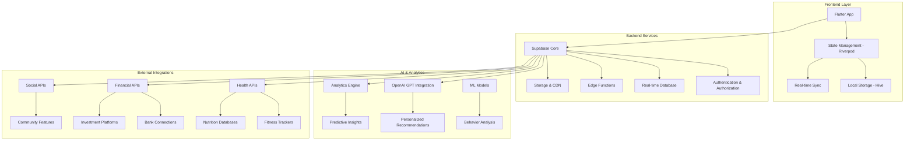

# 🚀 Empower Health & Wealth App - Flagship Version Architecture

## 🎯 Vision Statement
Transform the MVP into a comprehensive, AI-powered health and wealth empowerment platform that provides personalized insights, community support, and actionable guidance for users to achieve their life goals.

## 📊 Current MVP vs Flagship Comparison

| Feature Category | MVP Status | Flagship Vision |
|------------------|------------|-----------------|
| **Authentication** | ✅ Basic email/password | 🚀 Multi-factor, biometric, social login |
| **Navigation** | ✅ 4-tab bottom nav | 🚀 Adaptive navigation with contextual menus |
| **Health Tracking** | ✅ Basic goal setting | 🚀 AI-powered health insights with wearable integration |
| **Wealth Management** | ✅ Simple goal tracking | 🚀 Real-time portfolio tracking with investment advice |
| **User Experience** | ✅ Static content | 🚀 Personalized, adaptive, AI-driven experience |
| **Social Features** | ❌ None | 🚀 Community challenges, mentorship, social sharing |
| **Analytics** | ✅ Basic stats | 🚀 Advanced insights with predictive analytics |
| **Content** | ✅ Static modules | 🚀 Dynamic, personalized learning paths |

## 🏗️ Flagship Architecture Overview



## 🎯 Core Flagship Features

### 1. **Advanced Health Tracking System**

#### **Smart Health Dashboard**
- **Real-time Vitals Monitoring**: Integration with Apple Health, Google Fit, Fitbit
- **AI Health Insights**: Personalized recommendations based on data patterns
- **Predictive Health Analytics**: Early warning systems for health risks
- **Nutrition Intelligence**: AI-powered meal planning and nutrition tracking

#### **Wearable Integration**
```dart
// Health Data Integration Service
class HealthDataService {
  // Apple HealthKit integration
  Future<HealthData> syncAppleHealth();
  
  // Google Fit integration
  Future<HealthData> syncGoogleFit();
  
  // Fitbit API integration
  Future<HealthData> syncFitbitData();
  
  // AI analysis of health patterns
  Future<HealthInsights> analyzeHealthTrends();
}
```

#### **Advanced Health Features**
- **Symptom Tracking**: AI-powered symptom analysis and recommendations
- **Medication Reminders**: Smart scheduling with interaction warnings
- **Mental Health Monitoring**: Mood tracking with AI-powered insights
- **Sleep Optimization**: Advanced sleep analysis with improvement suggestions

### 2. **Comprehensive Wealth Management**

#### **Real-time Financial Dashboard**
- **Portfolio Tracking**: Live investment performance with detailed analytics
- **Bank Account Integration**: Secure connection to multiple financial institutions
- **Expense Intelligence**: AI-powered spending analysis and optimization
- **Investment Recommendations**: Personalized investment strategies

#### **Financial Planning Tools**
```dart
// Wealth Management Service
class WealthManagementService {
  // Real-time portfolio tracking
  Future<Portfolio> getPortfolioData();
  
  // AI-powered investment advice
  Future<InvestmentAdvice> getPersonalizedAdvice();
  
  // Expense categorization and analysis
  Future<ExpenseAnalysis> analyzeSpendingPatterns();
  
  // Financial goal optimization
  Future<GoalStrategy> optimizeFinancialGoals();
}
```

#### **Advanced Wealth Features**
- **Robo-Advisor Integration**: Automated investment management
- **Tax Optimization**: AI-powered tax planning and optimization
- **Debt Management**: Smart debt payoff strategies
- **Retirement Planning**: Comprehensive retirement planning tools

### 3. **AI-Powered Personalization Engine**

#### **Intelligent Recommendation System**
```dart
// AI Recommendation Engine
class AIRecommendationEngine {
  // Personalized health recommendations
  Future<List<HealthRecommendation>> getHealthRecommendations();
  
  // Financial optimization suggestions
  Future<List<WealthRecommendation>> getWealthRecommendations();
  
  // Learning path optimization
  Future<LearningPath> getPersonalizedLearningPath();
  
  // Goal achievement strategies
  Future<GoalStrategy> optimizeGoalAchievement();
}
```

#### **Machine Learning Features**
- **Behavioral Analysis**: Understanding user patterns and preferences
- **Predictive Modeling**: Forecasting goal achievement probability
- **Adaptive Content**: Dynamic content based on user progress
- **Smart Notifications**: Contextual and timely engagement

### 4. **Social & Community Features**

#### **Community Platform**
- **Social Challenges**: Group challenges for health and wealth goals
- **Mentorship Program**: Connect users with experienced mentors
- **Success Stories**: Share and celebrate achievements
- **Discussion Forums**: Topic-based community discussions

#### **Social Integration**
```dart
// Social Features Service
class SocialFeaturesService {
  // Community challenges
  Future<List<Challenge>> getActiveChallenges();
  
  // Mentorship matching
  Future<Mentor> findMentor(UserProfile profile);
  
  // Social sharing
  Future<void> shareAchievement(Achievement achievement);
  
  // Community leaderboards
  Future<Leaderboard> getCommunityLeaderboard();
}
```

### 5. **Advanced Gamification System**

#### **Enhanced Achievement System**
- **Dynamic Achievements**: AI-generated personalized achievements
- **Streak Multipliers**: Advanced streak tracking with bonus rewards
- **Seasonal Events**: Limited-time challenges and rewards
- **Virtual Rewards**: NFT-style digital collectibles

#### **Gamification Engine**
```dart
// Gamification Service
class GamificationService {
  // Dynamic achievement generation
  Future<List<Achievement>> generatePersonalizedAchievements();
  
  // XP and level calculation
  Future<UserLevel> calculateUserLevel();
  
  // Reward distribution
  Future<void> distributeRewards(Achievement achievement);
  
  // Leaderboard management
  Future<void> updateLeaderboards();
}
```

## 🔧 Technical Implementation Strategy

### **Phase 1: Foundation Enhancement (Weeks 1-4)**
1. **State Management Upgrade**: Implement Riverpod for advanced state management
2. **Local Storage**: Add Hive for offline-first architecture
3. **API Architecture**: Create robust API layer with error handling
4. **Performance Optimization**: Implement lazy loading and caching

### **Phase 2: AI Integration (Weeks 5-8)**
1. **OpenAI Integration**: Implement GPT-powered recommendations
2. **Analytics Engine**: Build user behavior tracking system
3. **Machine Learning Pipeline**: Create data processing and model training
4. **Personalization Engine**: Implement adaptive content delivery

### **Phase 3: External Integrations (Weeks 9-12)**
1. **Health API Integration**: Connect with major health platforms
2. **Financial API Integration**: Implement bank and investment connections
3. **Wearable Device Support**: Add support for major fitness trackers
4. **Third-party Services**: Integrate payment, notification, and analytics services

### **Phase 4: Social & Community (Weeks 13-16)**
1. **Community Platform**: Build social features and forums
2. **Real-time Chat**: Implement messaging and group communication
3. **Mentorship System**: Create mentor-mentee matching algorithm
4. **Social Sharing**: Add social media integration and sharing features

### **Phase 5: Advanced Features (Weeks 17-20)**
1. **Advanced Analytics**: Implement predictive analytics and insights
2. **Notification System**: Build intelligent notification engine
3. **Content Management**: Create dynamic content delivery system
4. **Security Enhancements**: Implement advanced security measures

## 📱 Enhanced User Experience

### **Adaptive Interface**
- **Contextual Navigation**: Smart navigation based on user behavior
- **Personalized Dashboard**: AI-curated content and widgets
- **Voice Interface**: Voice commands and audio feedback
- **Accessibility Plus**: Advanced accessibility features

### **Multi-platform Strategy**
- **Flutter Web**: Progressive Web App for desktop users
- **Flutter Desktop**: Native desktop applications
- **API-First**: Enable third-party integrations and partnerships
- **White-label Solutions**: Customizable versions for enterprises

## 🔒 Security & Privacy

### **Advanced Security Features**
- **Zero-Knowledge Architecture**: End-to-end encryption for sensitive data
- **Biometric Authentication**: Face ID, Touch ID, and voice recognition
- **Multi-Factor Authentication**: SMS, email, and authenticator app support
- **Privacy Controls**: Granular privacy settings and data control

### **Compliance & Standards**
- **GDPR Compliance**: Full European data protection compliance
- **HIPAA Compliance**: Healthcare data protection standards
- **SOC 2 Type II**: Security and availability standards
- **ISO 27001**: Information security management standards

## 📊 Analytics & Insights

### **Advanced Analytics Dashboard**
- **Real-time Metrics**: Live user engagement and app performance
- **Predictive Analytics**: User behavior prediction and churn prevention
- **A/B Testing**: Continuous feature testing and optimization
- **Business Intelligence**: Revenue and growth analytics

### **User Insights**
- **Behavioral Analytics**: Deep user behavior understanding
- **Goal Achievement Prediction**: AI-powered success probability
- **Personalization Metrics**: Content relevance and engagement
- **Health & Wealth Correlation**: Cross-domain insights and recommendations

## 🚀 Monetization Strategy

### **Freemium Model**
- **Free Tier**: Basic tracking and goal setting
- **Premium Tier**: AI insights, advanced analytics, unlimited goals
- **Pro Tier**: Full feature access, priority support, exclusive content
- **Enterprise Tier**: White-label solutions, custom integrations

### **Revenue Streams**
- **Subscription Revenue**: Monthly and annual premium subscriptions
- **Affiliate Partnerships**: Financial services and health product partnerships
- **Data Insights**: Anonymized insights for research and development
- **Enterprise Solutions**: B2B health and wellness platform licensing

## 🎯 Success Metrics

### **User Engagement**
- **Daily Active Users (DAU)**: Target 70% of registered users
- **Session Duration**: Average 15+ minutes per session
- **Feature Adoption**: 80% of users using core features
- **Retention Rate**: 90% 7-day, 70% 30-day retention

### **Business Metrics**
- **Conversion Rate**: 15% free-to-premium conversion
- **Customer Lifetime Value**: $200+ average LTV
- **Churn Rate**: <5% monthly churn rate
- **Net Promoter Score**: 70+ NPS score

## 🗓️ Development Timeline

### **6-Month Flagship Development Plan**

| Phase | Duration | Key Deliverables |
|-------|----------|------------------|
| **Phase 1** | Weeks 1-4 | Foundation enhancement, state management |
| **Phase 2** | Weeks 5-8 | AI integration, personalization engine |
| **Phase 3** | Weeks 9-12 | External API integrations, wearable support |
| **Phase 4** | Weeks 13-16 | Social features, community platform |
| **Phase 5** | Weeks 17-20 | Advanced analytics, security enhancements |
| **Phase 6** | Weeks 21-24 | Testing, optimization, launch preparation |

## 🎉 Flagship Launch Strategy

### **Beta Testing Program**
- **Closed Beta**: 100 selected users for initial testing
- **Open Beta**: 1,000 users for broader feedback
- **Influencer Program**: Health and finance influencers for promotion
- **Community Building**: Pre-launch community engagement

### **Marketing & Launch**
- **Product Hunt Launch**: Featured product launch
- **App Store Optimization**: Premium app store presence
- **Content Marketing**: Blog, social media, and video content
- **Partnership Program**: Strategic partnerships with health and finance brands

---

**Next Steps**: This flagship architecture provides a comprehensive roadmap for transforming the MVP into a world-class health and wealth empowerment platform. The implementation should be phased to ensure quality and user feedback integration at each stage.